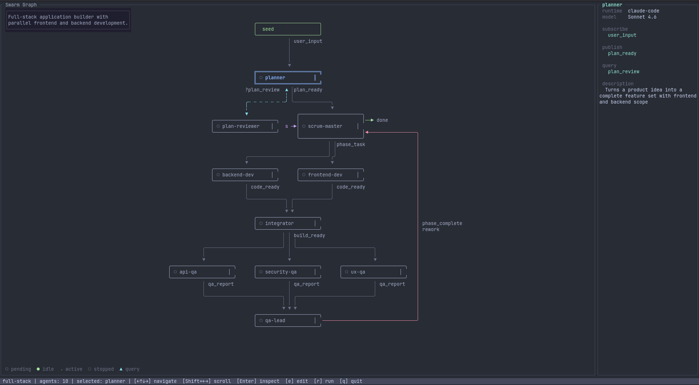

# yrr

Swarms of loosely coupled agents communicating via Pub/Sub/Query.

## What is this?

A completely vibe-coded (in case you are wondering, yes, I hate myself a bit for using this term) experiment that emerged from the curiosity of playing with groups of agents and seeing how they interact.
If you are not careful `yrr` will waste all your tokens, so bear that in mind.
Use at your own discretion.

## Philosophy
The philosophy of this repo is very simple: loosely coupled agents in arbitrary topologies, writing code collaboratively. In order to achieve this, `yrr` uses [Zenoh](https://zenoh.io/), a pub/sub/query protocol, for inter-agent communication. 
Agents and swars are declared in yaml files, where you can define the signals they receive (sub), the signals they emit (pub), and the data they request (query). Agents are composed into more complex swarms that can perform complex workflows.

## How it works

There are two primitives: **agents** and **swarms**, both are defined declaratively in YAML files.

**Agents**: give them instructions and define the topics (or, in Zenoh terms, the key expressions) to which they should publish, query, or subscribe. Each agent runs as an isolated process (e.g. a Claude Code session) with a sidecar that handles the Zenoh communication.

**Swarms** are simply groups of interacting agents.

### Some `yrr` features

| Concept   | What it does |
|-----------|-------------|
| `subscribe` / `publish` | Pub/sub signals — implicit wiring via name matching |
| `queryable` / `query` | Synchronous request/reply between agents |
| `replicas: N` | Spawn N copies of an agent |
| `collect: { signal: N }` | Buffer N signals before triggering |
| `dispatch` | Route signals to replicas (broadcast, round-robin, random) |
| `lifecycle` | Ephemeral vs persistent agents, `max_activations`, `die_on` |
| `permissions` | Tool allow/deny, path allow/deny, network access |

### Example: dev pipeline

Three agents — planner, coder, reviewer — form a feedback loop:

```yaml
# agents/coder.yaml
agent:
  name: coder
  description: "Implements features based on the plan"
  runtime: claude-code
  config:
    model: claude-sonnet-4-6
  prompt: |
    You are a senior developer. Read the plan, implement the code,
    then build and test locally before emitting code_ready.
  subscribe:
    plan_ready: "filepath to the implementation plan"
    review_failed: "list of issues to fix with file paths and line numbers"
  publish:
    code_ready: "summary of what was implemented and changed files"
  lifecycle:
    mode: persistent
    max_activations: 5
  permissions:
    tools:
      allow: [read, write, edit, bash, glob, grep]
      deny: [git_push]
    network: false
```

```yaml
# swarms/dev-pipeline.yaml
swarm:
  name: dev-pipeline
  description: "Plan, implement, review with feedback loop"

  agents:
    planner:
      use: ../agents/planner
    coder:
      use: ../agents/coder
    reviewer:
      use: ../agents/reviewer

  entry: task_received
  done: [review_passed]
```

## Getting started

If you want to give it a try, clone and install from source:

```bash
git clone https://github.com/adolfo-ab/yrr.git
cd yrr
cargo install --path crates/yrr-tui
```

Then run a swarm:

```bash
yrr path/to/swarm.yaml --prompt "Build the classic snake game. Make no mistakes."
```

Starts in preview mode where you can explore the swarm graph before running. It hot-reloads agent and swarm files while in preview mode.



## Roadmap

* Adding support for more coding agent runtimes (cursor, codex...).
